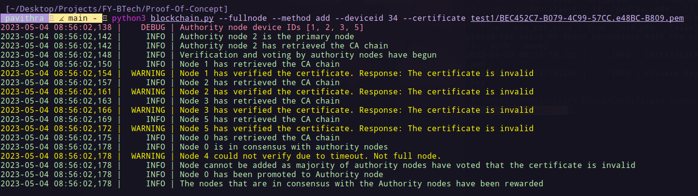
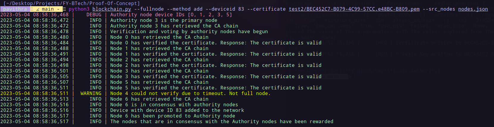
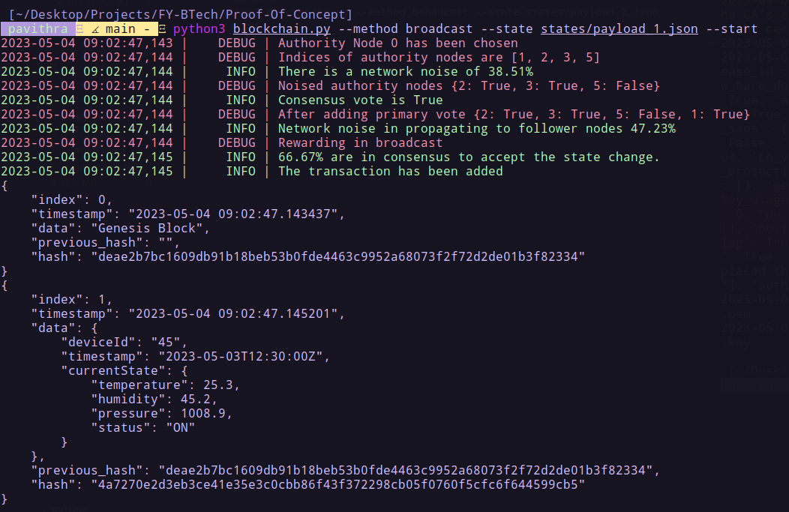
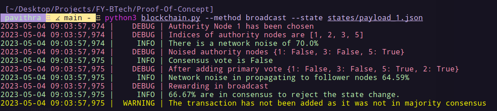
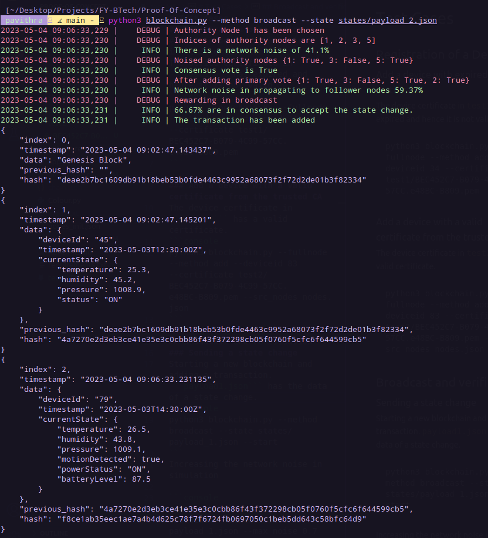

# Proof-Of-Concept
This repository contains the source code for depicting the proof of concept of the idea proposed.

Create a virtual environment
```console
virtualenv blockchain
source blockchain/bin/activate
```

Install the required libraries and packages
```console
pip install -r requirements.txt
```

Run the verification server to verify the Device certificates against the CA chain
```console
python3 app.py
```

Help menu
```console
python3 blockchain.py -h
```
```console
usage: blockchain.py [-h] [--method {add,remove,viewnode,broadcast}] [--certificate CERTIFICATE] [--fullnode]
                     [--deviceid DEVICEID] [--node NODE] [--state STATE] [--start] [--cpath CPATH]
                     [--src_nodes SRC_NODES] [--dest_nodes DEST_NODES] [--max_noise MAX_NOISE]

This simulates the Proof of Concept for the blockchain with Proof of Verified Authority Consensus

options:
  -h, --help            show this help message and exit
  --method {add,remove,viewnode,broadcast}
                        This argument facilitates choosing the action on a node
  --certificate CERTIFICATE
                        The argument enables you to specify the path to the device certificate file
  --fullnode            This is a flag to indicate if the device is a full node
  --deviceid DEVICEID   This argument specifies the device ID
  --node NODE           This argument specifies the node index for the viewnode method
  --state STATE         This argument specifies the path to payload file containing the state
  --start               This flag indicates to start a new a new blockchain
  --cpath CPATH         This argument takes in the path to store the chain persistently
  --src_nodes SRC_NODES
                        This argument takes in the path that contains the pre-added nodes
  --dest_nodes DEST_NODES
                        This argument takes in the path to store the newly added or updated nodes
  --max_noise MAX_NOISE
                        This argument takes the maximum permissable network noise for broadcast [value between 0-1]
```
## Test
## Registration of a Device
### Add a device with expired/invalid certificate
The device certificate in ```test1/``` has expired and hence it is not valid.
```console
python3 blockchain.py --fullnode --method add --deviceid 34 --certificate test1/BEC452C7-B079-4C99-57CC.e48BC-B809.pem
```

### Add a device with a valid certificate from the trusted CA
The device certificate in ```test2/``` has a valid certificate.
```console
python3 blockchain.py --fullnode --method add --deviceid 83 --certificate test2/BEC452C7-B079-4C99-57CC.e48BC-B809.pem --src_nodes nodes.json
```

## Broadcast and verification
### Sending a state change
Starting a new blockchain and adding a transaction. ```payload1.json``` has the data of a state change.
```console
python3 blockchain.py --method broadcast --state states/payload_1.json --start
```

Increasing the network noise in simulation

```console
python3 blockchain.py --method broadcast --state states/payload_1.json --max_noise 0.7
```

### Adding the next transaction
```console
python3 blockchain.py --method broadcast --state states/payload_2.json
```


